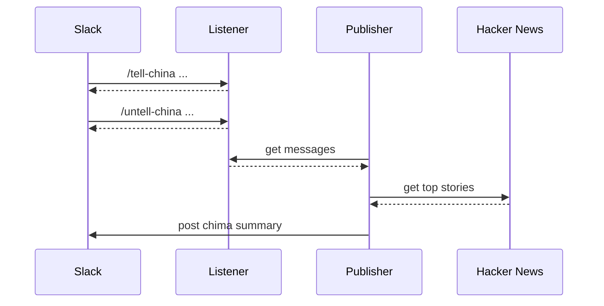

# tellchima

```mermaid
sequenceDiagram
    Slack ->> Listener: /tell-china ...
    Listener -->> Slack: 
    Slack ->> Listener: /untell-china ...
    Listener -->> Slack: 
    Publisher ->> Listener: get messages
    Listener -->> Publisher: 
    Publisher ->> Hacker News: get top stories
    Hacker News -->> Publisher: 
    Publisher ->> Slack: post chima summary
```

## Listener

- Ocaml
  - esy
- SQLite
  - dbmate

## Publisher

- Go
